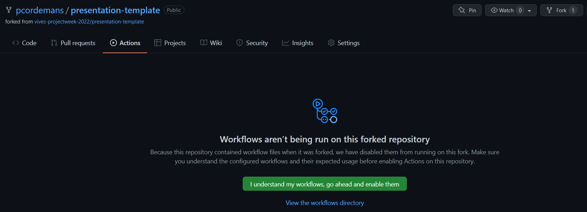
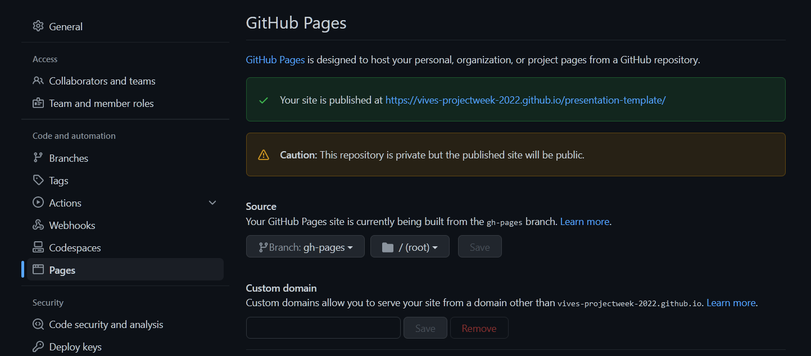

# Marp Presentation Template

## Presentation

HTML: [View](https://vives-projectweek-2022.github.io/presentation-template/presentation.html)
PDF: [Download](https://vives-projectweek-2022.github.io/presentation-template/presentation.pdf)

## Getting Started

1. Fork this repository
1. In GitHub - Actions: Enable the GitHub Actions Workflows

1. Push a new commit to the repository
1. In GitHub - Settings: Select the gh-pages branch to build the GitHub pages

1. Change the URL of this README to your URL: https://yourname.github.io/presentation-template/presentation.html
1. Push the commit to the repository

## Writing slides

Install the [marp cli](https://github.com/marp-team/marp-cli) tool:

```bash
npm install -g @marp-team/marp-cli
```

You can use the _Marp for VS Code_ extension to preview the presentation in VS Code:

<https://marketplace.visualstudio.com/items?itemName=marp-team.marp-vscode>

or install it using

```bash
code --install-extension marp-team.marp-vscode
```
